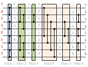

# Sorting on the Maxeler dataflow machine

Simplex algorithm for the Maxeler data-flow computer architecture. The data-flow engine is mainly responsible for the pivoting operation.

The implementation in the APP directory is streaming data from LMEM as vectors.

In the directory **other**, three other implementations can be found:
 - simplex-stream : streaming the data from the main memory, one element at a time.
 - simplex-stream-vec : streaming the data from the main memory as vectors.
 - simplex-lmem : streaming the data from LMEM, one element at a time.
 
